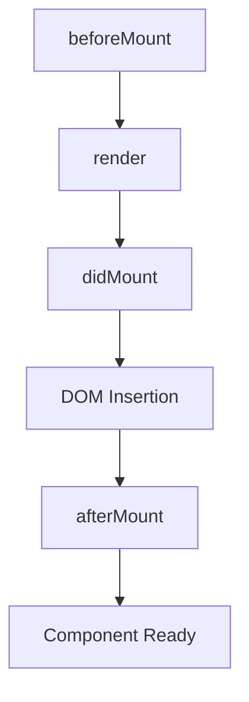

# afterMount

The `afterMount` lifecycle method executes after the component's DOM has been inserted into the document and all child components have completed their mounting process.

## Overview

`afterMount` is called asynchronously after the component is fully mounted and integrated into the DOM. This is the ideal place for operations that require live DOM access, such as third-party library initialization, API calls, and setting up observers.

## Timing



## Signature

```typescript
afterMount(): void | Promise<void>
```

The method can be either synchronous or asynchronous. If it returns a Promise, the framework will handle async execution properly.

## When to Use afterMount

Use `afterMount` for operations that require:

-   **Live DOM access** - Elements must be in the document
-   **Third-party library initialization** - Libraries that need rendered DOM
-   **API calls** - Data fetching for component initialization
-   **Observer setup** - Intersection, Resize, or Mutation observers
-   **Animation initialization** - CSS transitions or JavaScript animations
-   **Focus management** - Setting initial focus or accessibility setup

## Examples

### Basic Usage

```typescript
import { AtomComponent } from '@atomdev/core';

class DataChart extends AtomComponent {
    async afterMount() {
        // DOM is live and accessible
        await this.fetchChartData();
        this.initializeChart();
    }

    private async fetchChartData() {
        const response = await fetch('/api/chart-data');
        this.setState({ data: await response.json() });
    }

    private initializeChart() {
        const canvas = document.getElementById('chart-canvas');
        // Initialize charting library
    }
}
```

### Third-Party Library Integration

```typescript
class MapComponent extends AtomComponent {
    private mapInstance: any;

    afterMount() {
        // Initialize mapping library after DOM is ready
        this.mapInstance = new MapLibrary({
            container: this.refs.mapContainer,
            style: 'mapbox://styles/mapbox/streets-v11',
            center: [-74.5, 40],
            zoom: 9,
        });
    }

    render() {
        return (
            <div
                ref='mapContainer'
                className='map-container'
            />
        );
    }
}
```

### Setting Up Observers

```typescript
class LazyImage extends AtomComponent {
    private observer: IntersectionObserver | null = null;

    afterMount() {
        // Set up intersection observer for lazy loading
        this.observer = new IntersectionObserver((entries) => {
            entries.forEach((entry) => {
                if (entry.isIntersecting) {
                    this.loadImage();
                }
            });
        });

        const imageElement = this.refs.image;
        if (imageElement) {
            this.observer.observe(imageElement);
        }
    }

    private loadImage() {
        const img = this.refs.image as HTMLImageElement;
        img.src = this.props.src;
        this.observer?.disconnect();
    }

    render() {
        return (
            
        );
    }
}
```

### Async Operations with Error Handling

```typescript
class UserProfile extends AtomComponent {
    async afterMount() {
        try {
            // Set loading state
            this.setState({ loading: true });

            // Fetch user data
            const userData = await this.fetchUserData();

            // Update component state
            this.setState({
                user: userData,
                loading: false,
            });

            // Initialize profile features
            this.setupNotifications();
        } catch (error) {
            this.setState({
                error: error.message,
                loading: false,
            });
        }
    }

    private async fetchUserData() {
        const response = await fetch(`/api/users/${this.props.userId}`);
        if (!response.ok) {
            throw new Error('Failed to fetch user data');
        }
        return response.json();
    }
}
```

## Error Handling

The framework provides automatic error handling for `afterMount`:

```typescript
class RobustComponent extends AtomComponent {
    afterMount() {
        // If this throws an error, the component remains functional
        this.riskyOperation();
    }

    private riskyOperation() {
        // Even if this fails, the component won't crash
        throw new Error('Something went wrong');
    }
}
```

Errors in `afterMount` are:

-   Automatically caught by the framework
-   Logged to the console with context
-   Do not crash the component or application

## Best Practices

### Do

```typescript
class GoodExample extends AtomComponent {
    async afterMount() {
        // ✅ API calls
        await this.loadData();

        // ✅ Third-party library setup
        this.initializeLibrary();

        // ✅ Observer setup
        this.setupIntersectionObserver();

        // ✅ Focus management
        this.focusFirstInput();
    }
}
```

### Don't

```typescript
class BadExample extends AtomComponent {
    afterMount() {
        // ❌ Don't manipulate props directly
        this.props.data = newData;

        // ❌ Don't perform CPU-intensive sync operations
        this.heavyComputationThatBlocksUI();

        // ❌ Don't forget error handling for critical operations
        this.criticalOperationWithoutErrorHandling();
    }
}
```

## Performance Considerations

-   `afterMount` executes asynchronously and won't block rendering
-   Heavy operations should be moved to web workers when possible
-   Use `setState` carefully to avoid unnecessary re-renders
-   Clean up resources (observers, timers) in cleanup methods

## Testing

Testing components with `afterMount`:

```typescript
import { executeAfterMount } from '@atomdev/core/lifecycle/afterMount';

describe('MyComponent', () => {
    it('should initialize correctly after mount', async () => {
        const component = new MyComponent({ prop: 'value' });

        // Execute afterMount lifecycle
        await executeAfterMount(component);

        // Assert expected behavior
        expect(component.state.initialized).toBe(true);
    });
});
```

## Related

-   [didMount](./didMount) - Pre-insertion DOM setup
-   [beforeMount](./beforeMount) - Pre-render setup
-   [Lifecycle Overview](./overview) - Complete lifecycle documentation
